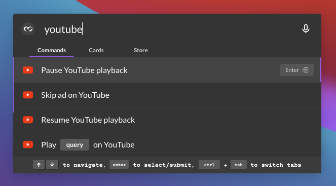

# Control YouTube - Easy

## What we are building

When we're done with this tutorial, you'll have built skills to do the following without opening your browser at all -

* Search and play a video on YouTube
* Pause YouTube playback
* Resume YouTube playback



## What we are learning

We'll be doing this entirely with the Browser Automation module, without using any special YouTube API or anything. So we'll be going over how to do the following with the browser automation module:

* Click on an element on a page (`Click` node)
* Open a URL in a new tab (`Open` node)
* Query open tabs (`Find Tab` node)
* Execute a function (a method, to be precise) on an element on a page (`Execute Function` node)

Let's take this one skill at a time, in order.

## Search for and play a video on YouTube

We want this skill to search for a video and play it on YouTube, without the user ever having to switch to the browser. Let's break this down into steps. This'll do for a start -

1. Take query as input from the user
2. Search for the query on YouTube
3. Click on the first video result (after this, the video starts playing automatically)
4. Tell the command bar the skill executed successfully

### #1: Take query as input from the user

First off, we need to specify what the skill prompt will say and how the user will provide input. This is what we want the skill to look like -

.png>)

Drop a `bot-command` node on the editor, double click on it and configure it like shown below (if this is unfamiliar to you, you might wanna go over this more basic tutorial covering the basics of skill building).

.png>)

When you click "Done", the node should look like this in the editor -&#x20;

.png>)

### #2: Search for the query on YouTube

The next thing we want to do is search for `query` on YouTube. If you notice, searching for a query on YouTube is the same thing as navigating to `youtube.com/results?search_query={query}`

Let's create this URL. Drag a `function` node (you'll find it at the top of the pallette) on to the editor and connect it to our `bot-command` node. Double click on this node and put this code inside -

```javascript
msg.searchUrl = `https://youtube.com/results?search_query=${msg.payload.query.value}`
return msg
```

It's going to look like this when you're done:

.png>)

All we're doing here is constructing the URL we want to redirect to, and adding it as a property (`searchUrl`) to the `msg` object forwarded by this node. We can now access this URL in other nodes.

This is what you should have at this point.

.png>)

Now that we have the URL, ets configure our skill to open it in a new tab. Drag an `Open` node (from the Maya Browser Automation module) to the editor, and double click on it.

.png>)

The URL that we want this node to open is in the `searchUrl` property of the `msg` object. So, select "msg." from the left dropdown on the "url" property and put "searchUrl" in the text input on the right of the dropdown.

 (1).png>)

.png>)

Click "Done" to confirm these settings, and then connect this Open node to the function node. Your flow should now look like this:

.png>)

This is all we need to search for the query on YouTube. Pretty straightforward. Now let's move on to the second part of the skill, which is to click the first search result. The `Open` node will add a property called `tabs` to the `msg` object, which is an array containing a single `Tab` object corresponding to the browser tab that was just opened. A `Tab` object contains these properties. This will be useful in a bit.

### #3: Clicking on the first result

To click an element, we need to know it's corresponding xpath on the page.


If you're not aware of xpaths, we recommend you read this and get familiar with them. A lot of Maya's Browser Automation functionality depends on xpaths and its a powerful tool by itself, so we promise it's gonna be worth your while. You can check out our resource on xpaths here.


This is what the YouTube search results page looks like, and we want Maya to click on the highlighted thumbnail.

.png>)

The corresponding element selected in the devtools is the tag `<a id="thumbnail">`. The corresponding xpath for this element would then be:

```
//a[@id='thumbnail']
```

Although, this xpath corresponds to every single thumbnail on the page. We just want the first of them, so we simply modify the xpath to give us just the first element:

```
(//a[@id='thumbnail'])[1]
```

Now that we have the xpath, we can wire up a `Click` node to click on it. First, drag a `Click` node to the editor and double click on it. You'll should see something like this in the node's config panel.

.png>)

All the properties except `selector` are filled out for us already, and we can leave them as is. Notice how `tabId` is set to `msg.tabs[0].id`. The `msg.tabs` property was set by the `Open` node that comes right before this node, remember? We access the `id` of the tab we just opened through `tabs[0].id`.

Once you enter the selector in the node config, it's gonna look exactly like this:

.png>)

Click "Done" to close the node config and connect the `Click` node to the `Open` node before it. The flow should now look like below. The only thing we need to do now is to notify the command bar that the skill has finished executing.

.png>)

### #4: Tell the command bar the skill executed successfully

This is easy. Just drag a `bot-response` node (from the `botutils` module) to the editor and connect the `Click` node to it. Your skill should look like this:

.png>)

That's it. Hit "Deploy" and try your skill from the command bar! Make sure you've given Maya permission to [youtube.com](http://youtube.com) via the extension before you try it, though.

## Pause videos on YouTube

We want this skill to allow you to pause/resume playback on YouTube without having to switch to the YouTube tab or even opening the browser. We'll do this with two skills - one to pause and one to resume, like this:

.png>)

Let's build the pause skill first, the resume skill will be similar. Like before, let's break this down into steps. There are two ways we can do this -

* Click Pause button on the YouTube tab
* Execute the `<video>` element's `pause()` method on the YouTube tab

We'll take the second approach (it's a lot more reliable, and this way we get to show you how the `Execute Function` node works hehe). Here's the steps we need to take -

1. Take input from the user
2. Find out which tab is playing YouTube
3. Execute the `<video>` element's `pause()` method on this tab.
4. Tell the command bar the skill executed successfully

### #1: Take input from the user

This is similar to what we did with the search-and-play skill above, so let's not waste time going over it again. This is what your `bot-command` node should look like -

.png>)

### #2: Find out which tab is playing YouTube

The `Execute Function` node performs a page-automation action (i.e., does something with the website's interface). All page-automation actions require you to specify the ID of the tab on which you want to perform them. In our case, we need the ID of the tab which is playing the YouTube video.

Drag a `Find Tab` node to the editor and double click on it. There's just one field - "query". This is a JSON field that will contain a standard chromium tab query. You can check out what a query can contain at [this MDN page](https://developer.mozilla.org/en-US/docs/Mozilla/Add-ons/WebExtensions/API/tabs/query). We want a tab whose URL is of the pattern `*://*.youtube.com/watch*` and is producing some sound. Here's the corresponding tab query:

```javascript
{
	"url": "*://*.youtube.com/watch*",
	"audible": true
}
```

Click on the three dots to the right of the query field to expand it, and then enter the above query into it.


.png>)

Click "Done" to confirm these settings, and connect the `Find Tab` node to the `bot-command` node. The `Find Tab` node will set a property called `tabs` on the `msg` object, containing an array of `Tab` objects that match the query. Ideally, only one tab should match the query (what kind of a psychopath has two audible youtube videos playing at once?), so we'll just select the first element of this array.

This is what the skill should look like at this point.

.png>)

### #3: Execute the \<video> element's pause() method on this tab

Any HTML5 video player can be paused by calling its `pause()` method, and the YouTube player is no different. The `Execute Function` node is used exactly for things like this, so drag it out to the editor and double click on it.

This is what you'll see.

.png>)

The highlighted element here is a `<video>` tag. Since there is only one `<video>` element on the entire page, it's xpath is simply `//video`. That's what we'll put in the "selector" field.

.png>)

In the "function" field we'll put "pause", since that's the name of the function we wanna call. Since the `pause()` function takes no arguments, we can just set an empty JSON array (`[]`) in the "arguments" field. The "tabId" field is already set to use the value `msg.tabs[0].id`, which is what we want. The node config should finally look like this -

.png>)

Click on "Done" to save these node properties, and then connect the `Execute Function` node to the `Find Tab` node. The skill should finally look like this at this point -

.png>)

All that's left now is to tell the command bar about skill completion.

### #4: Tell the command bar the skill executed successfully

Just like we did it for the search-and-play skill, drag a `bot-response` node to the editor and connect it to the `Execute Function` node. The final skill should look like this:

.png>)

That's it! Try playing something on YouTube and then run this skill, the video should pause.

## Resume videos on YouTube

The skill to resume playback is gonna be exactly similar, except that we'll be executing the `play()` function instead of the `pause()` function and in our tab query we won't be looking for an audible tab (since the tab ideally won't be playing anything). For this, just remove `"audible": true` key from the tab query in the `Find Tab` node.

Try building this one on your own!
