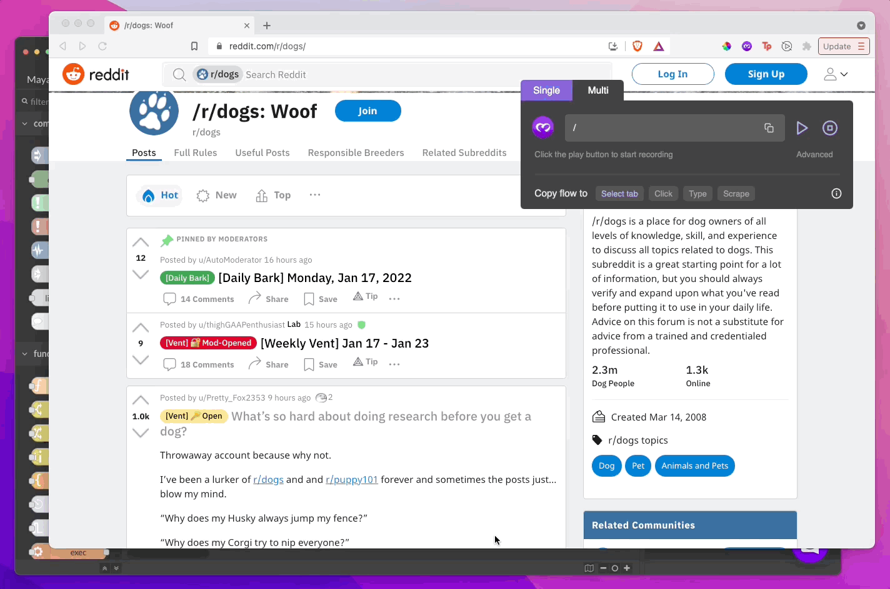

# Making a web automation skill in 5 minutes

The Maya browser extension allows you to [record xpaths by simply hovering over elements](recording-xpaths.md), and auto-generate nodes that you can import and connect in the editor to make fully functional flows from scratch.

In this tutorial we'll build a skill that scrapes the titles of the first few posts on r/dogs.

### Open the r/dogs subreddit

Go to r/dogs and open the recorder. Click the purple "Select tab" button in the bottom (you don't need to have selected an element yet). This will copy a JSON to your clipboard, which corresponds to a flow that finds a tab that has r/dogs open, or opens one if no such tab exists. Import this JSON into the skill editor.

### Scrape the post titles

On r/dogs, use the multi-select recorder to select post-title xpaths. Once done, click the "Scrape" button. This will copy a JSON to your clipboard, which corresponds to a node that scrapes the post-titles based on the select xpaths. Import this JSON into the skill editor.

### Wire up the flow

Connect the query node to the find-tab flow. For this we need to connect it to the second output of the switch node and the output of the open-tab node. After this, the flow should look like this -

.png>)


The delay node is added after the Open node so that the page has some time to load before we try to scrape.


### Test the flow

Add an inject node at the beginning of the flow, and add a debug node at the end so you can see the results. An inject node is used to send a signal down the flow and run it.

The final flow should look like this -

.png>)


Both the inject and debug nodes can be found towards the top of your node palette in the left of the editor.


### Run the flow!

Click the button on the inject node to run the flow once. Go to the debug section in the editor to see the logged message. The debug section can be accessed by clicking on the bug icon in the top-right of the editor.

.png>)

You can find the results inside the `results -> desiredValue` property.

.png>)

For now we'll stop at just logging the results, but you could do more from here, like adding these results to a CSV, showing them in a custom dashboard, etc. Play around, get creative!
