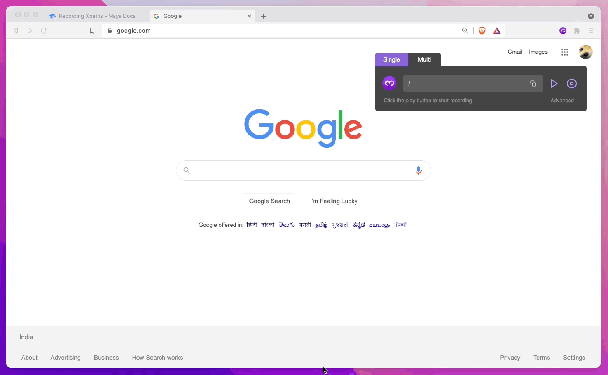
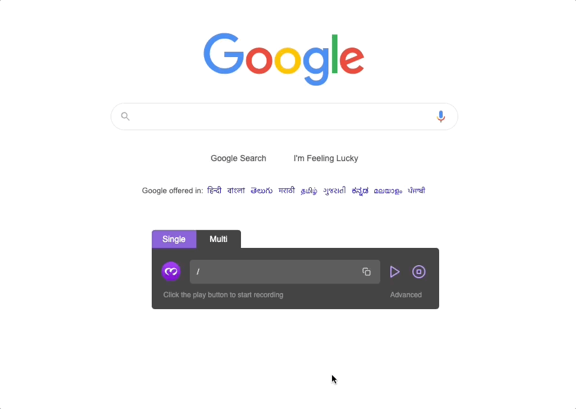
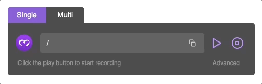
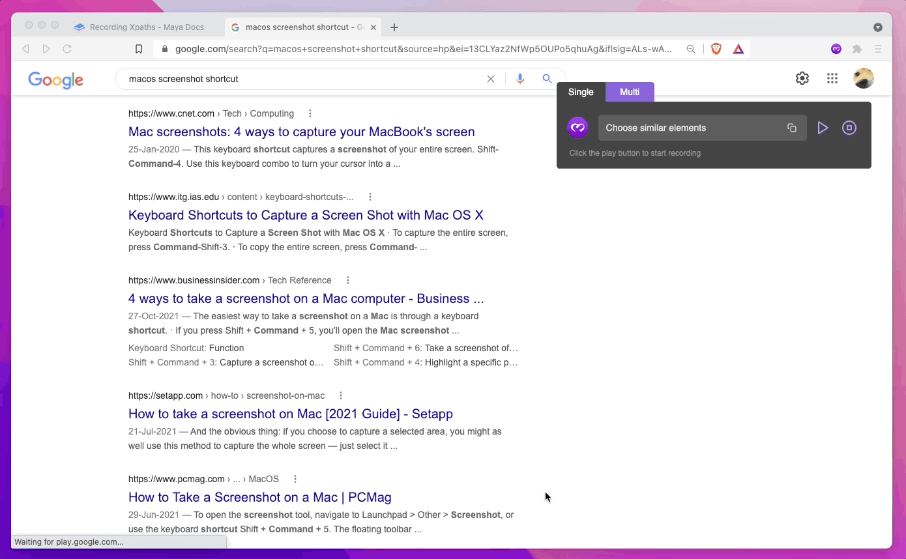

# Recording Xpaths

## Opening the recorder

Go to the website you wish to record on, and click on the Maya logo in your browser toolbar (if it's not present there, click on the puzzle logo to find the extension and pin it). This will open a popup that looks like this -

.png>)

To start recording, click on the "Record" button at the bottom right, and click anywhere to close the extension popup.


Upon clicking "Record", you may be prompted to give the extension permission for the page, if it doesn't already have it.


You will see a recorder widget at the top-right of the screen now, looking like this -

 (1).png>)

You can drag the recorder to any other position on the page if the current position is inconvenient.

## Modes of recording

There are two modes of recording xpaths from the extension -

1. Single mode - get an xpath that represents single element on a page. For example, a button you want to click or a specific input you want to type into.
2. Multi mode - get an xpath that represents a list of elements on a page. For example, a list of tweets in a thread or the prices of a list of products on Amazon.

We'll take these modes up in order.

### Single Mode

This is the default mode of the recorder. It lets you select xpaths that represent single elements on a page, like a button you want to click or a specific input you want to type into.

There are three steps to select an xpath in single mode -

1. Click the "Play" button at the right side of the recorder to start recording.
2. Hover over the element you want an xpath for, till it gets highlighted in purple.
3. Press escape to lock your choice, and copy the generated xpath.


The xpath generation algorithm can sometimes take some time (1-2 seconds) to generate xpaths in Single Mode.


#### Advanced Single Mode

In some cases, you might want to exclude (or include) certain attributes in your xpaths to make them more robust (certain attributes like auto-generated `class` are more likely to change as the website changes with time.

To do this, select the element you want in Single Mode, and click on the "Advanced" link at the bottom-right of the recorder. From here, select or un-select the attributes you want to keep in the xpath.

Alternatively, you can also select the attributes first and then select the xpath, to see the changes reflected in real time.


This is a best-effort feature i.e., attribute inclusion/exclusion sometimes may not work. For example if you exclude all attributes except `aria-label` but the target element does not have that attribute, the feature will fail.


### Multi Mode

If you wish to get an xpath that corresponds to a list of similar elements on a webpage (like a list of prices on Amazon or a series of tweets from a Twitter thread), Multi Mode is the way to go.

#### Switching to Multi Mode

At the top of the recorder you can see two tabs, one labeled "Single" and the other labeled "Multi". Just click on the latter tab to switch to Multi Mode.

#### How to select

In Multi Mode, you need to select two elements (from the list you want to select) instead of one, to let the extension figure out which list you're "talking about". It's just like Single Mode, except for one extra step.

1.  Select the first element just like you would in Single Select. This time, the selection will not stop at the first element.

    1. Click Play
    2. Hover over the desired element
    3. Press ESC to lock selection.

    
2. Now select another element in the list.
   1. With the first element selected, hover over another element in the list.
   2. If the hovered-over element is of the same type as the first element and belongs to some list, the extension will highlight all other elements in the list.
   3. If this is the list you wanted to get, press ESC again to lock selection.

.gif>)


The xpaths generated in Multi Mode are not robust, i.e., it's possible that these xpaths will turn invalid in a few days (or a few months, depending on how lucky you are) because of changes made to the webpage. Don't expect this problem to go away anytime soon.

However, these xpaths are still good for more "immediate" use-cases like scraping or one-time automation.

