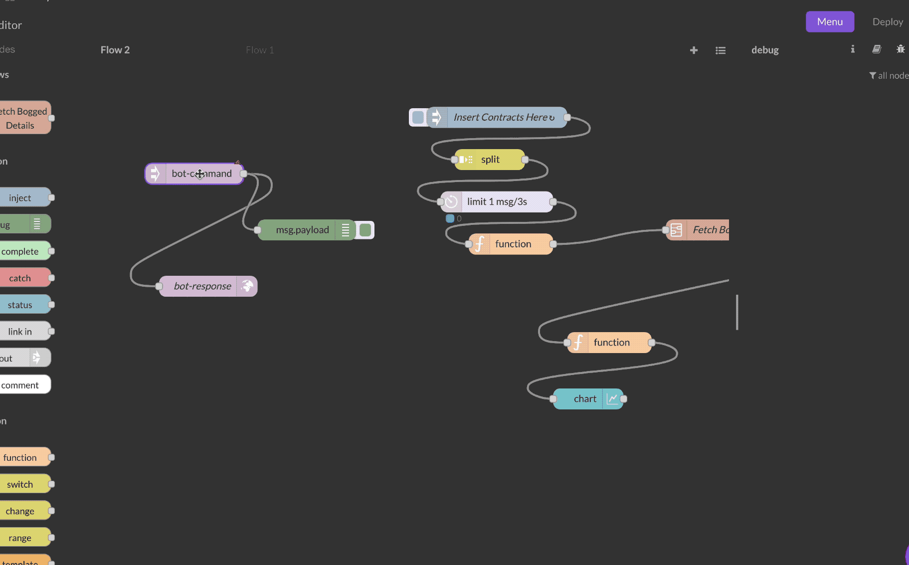

# Bot Command In

### Inputs

No inputs because this is a trigger node.

### Outputs

For the skill command shown in the GIF below, when inputs variables are `event`, `time`, and `email`, a sample output `msg.payload` on submitting the command would look like this :&#x20;

```json
{
    "event":{"value":"hello"},
    "time":{"value":"13 October 1700hrs","meta":{"hour":17,"minute":0,"meridiem":1,"day":13,"month":10,"year":2021,"second":0,"millisecond":0}},
    "email":{"value":"sibesh96@gmail.com","meta":"sibesh96@gmail.com"}
}
```

* `value` (string) : This is a string value which represents what the user has typed, or option name of what is visible to the user.
* `meta` (object) : This the hidden metadata that contains additional information about the option selected. &#x20;




### Details

The Bot Command node interfaces with the Maya command bar, exposing an endpoint to interact with it and send custom inputs easily. The types of variables you can use are listed below :&#x20;

### Custom variable

&#x20;Customize the command bar to search through any list or array using the Custom Search nodes - [Custom Search In](custom-search-in.md) and [Custom Search Out](custom-search-out.md).

### String variable&#x20;

Search through and select auto-suggest string options fetched from Google&#x20;

### Number variable

Enforce entry of a number everytime

### E-mail variable&#x20;

Allow user to search through their contacts and select an email address

### Phone variable&#x20;

Allow user to search through contacts and select a phone number

### Time variable

Allow user to specify an exact time in natural language "Oct 12th 5pm" which gets converted to computable time metadata.

### Time range variable

Allow user to specify a time range in natural language "5pm to 7pm" which gets converted to computable time metadata.


Always end a flow beginning with a `bot-command` node with a [`bot-response`](bot-command-out/bot-response.md) , [bot-web-card](bot-command-out/bot-web-card.md), or [bot-dash-card](bot-command-out/bot-dash-card.md) node in order to indicate to the user that a task has been completed/submitted. Failing to do so will mean the Command Bar gets stuck at loading state for 30 seconds.

