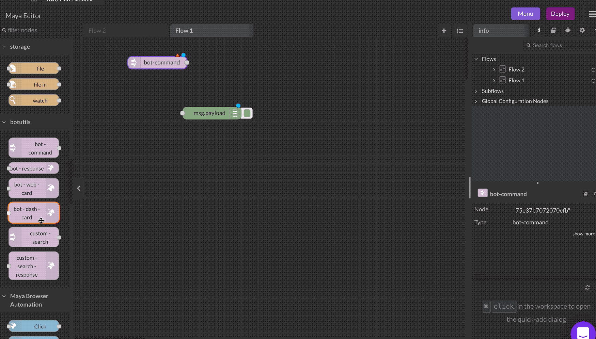
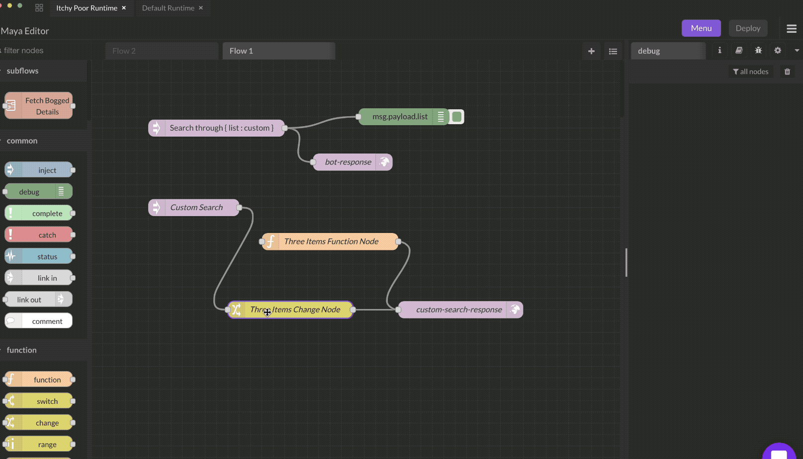

# Custom Search In

The Custom Search node let's you display, search and act on a custom list of items, like this Spotify skill that let's you query the Spotify API, display search results and then hit Enter to play a song.


### Inputs

This has no input ports.

### Output

* `search` (string) : The query that the user types is outputted in `msg.payload.search`.

### Details

Here are the steps to configure your own custom search.

### Step 1&#x20;

Drag and drop a `custom-search` node, connect it to a [`custom-search-response`](custom-search-out.md). Give it a custom name, say 'List Search'. When you try to make a command using the `bot-command` node and select Custom Variable, it show allow you to choose 'List Search' now.



### Step 2

Attach a data source, or hard code a list, and output that into the [`custom-search-response`](custom-search-out.md) node, like this.



You can build this from scratch, or just copy and import this flow below, and modify it to get started with custom search easily. Make sure `Maya Bot Utils` module is installed from the Store. Query term in `msg.payload.search` can be connected to search through external data source or API to fetch results and show them in the list.

```jsonp
[
    {
        "id": "78063d07d822bdda",
        "type": "tab",
        "label": "Flow 1",
        "disabled": false,
        "info": ""
    },
    {
        "id": "75e37b7072070efb",
        "type": "bot-command",
        "z": "78063d07d822bdda",
        "name": "",
        "order": 0,
        "options": [
            {
                "value": "Search through",
                "type": "prompt",
                "required": true
            },
            {
                "value": "list",
                "type": "custom",
                "required": false,
                "endpoint": "/search-f4bbe11ada38877c",
                "customNode": "f4bbe11ada38877c"
            }
        ],
        "formValue": {
            "Search through": "",
            "list": ""
        },
        "payload": "",
        "endpointUrl": "/command-75e37b7072070efb",
        "icon": "",
        "x": 220,
        "y": 120,
        "wires": [
            [
                "5085629ecfbbe9ef"
            ]
        ]
    },
    {
        "id": "f4bbe11ada38877c",
        "type": "custom-search",
        "z": "78063d07d822bdda",
        "name": "Custom Search",
        "payload": "",
        "endpointUrl": "/search-f4bbe11ada38877c",
        "x": 180,
        "y": 260,
        "wires": [
            [
                "b55401a1c250998a"
            ]
        ]
    },
    {
        "id": "66f2cebacd6aa07b",
        "type": "custom-search-response",
        "z": "78063d07d822bdda",
        "name": "custom-search-response",
        "statusCode": "",
        "headers": {},
        "x": 650,
        "y": 440,
        "wires": []
    },
    {
        "id": "b55401a1c250998a",
        "type": "change",
        "z": "78063d07d822bdda",
        "name": "Three Items Change Node",
        "rules": [
            {
                "t": "set",
                "p": "payload",
                "pt": "msg",
                "to": "[]",
                "tot": "json"
            },
            {
                "t": "set",
                "p": "payload[0]",
                "pt": "msg",
                "to": "{\"value\":\"Template 1\",\"meta\":{\"subtext\":\"This is template 1\"}}",
                "tot": "json"
            },
            {
                "t": "set",
                "p": "payload[1]",
                "pt": "msg",
                "to": "{\"value\":\"Template 2\",\"meta\":{\"subtext\":\"This is template 2\"}}",
                "tot": "json"
            },
            {
                "t": "set",
                "p": "payload[2]",
                "pt": "msg",
                "to": "{\"value\":\"Template 3\",\"meta\":{\"subtext\":\"This is template 3\"}}",
                "tot": "json"
            }
        ],
        "action": "",
        "property": "",
        "from": "",
        "to": "",
        "reg": false,
        "x": 350,
        "y": 440,
        "wires": [
            [
                "66f2cebacd6aa07b"
            ]
        ]
    },
    {
        "id": "5085629ecfbbe9ef",
        "type": "bot-response",
        "z": "78063d07d822bdda",
        "name": "bot-response",
        "status": "success",
        "statusMsg": "Success!",
        "statusMsgType": "str",
        "x": 460,
        "y": 180,
        "wires": []
    },
    {
        "id": "b30509486aa0b036",
        "type": "function",
        "z": "78063d07d822bdda",
        "name": "Three Items Function Node",
        "func": "var results = []\n\nresults.push({\"value\":\"Template 1\",\"meta\":{\"subtext\":\"This is template 1\"}})\nresults.push({\"value\":\"Template 2\",\"meta\":{\"subtext\":\"This is template 2\"}})\nresults.push({\"value\":\"Template 3\",\"meta\":{\"subtext\":\"This is template 3\"}})\nmsg.payload = results\nreturn msg;",
        "outputs": 1,
        "noerr": 0,
        "initialize": "",
        "finalize": "",
        "libs": [],
        "x": 420,
        "y": 320,
        "wires": [
            [
                "66f2cebacd6aa07b"
            ]
        ]
    }
]
```
