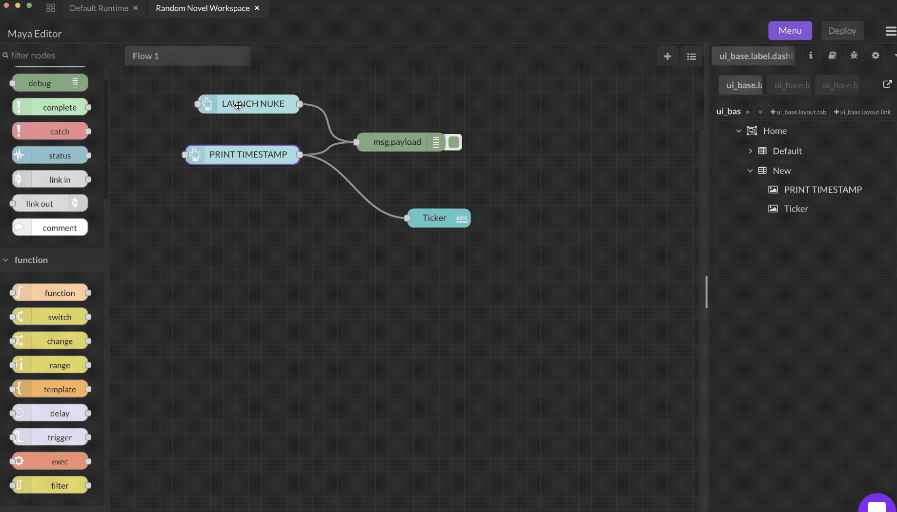

# Button

### Inputs

* `enabled` (boolean) : setting msg.enabled to false and passing it into the button node disables it.

### Outputs

You can customize what is emitted from the output ports upon clicking the button.

* `payload` (object) : Clicking the button generates a message with `msg.payload` set to the **Payload** field. If no payload is specified, the node id is used.
* `topic` (string) :  The **Topic** field can be used to set the `msg.topic` property that is output.

### Attributes

* **Size** : defaults to 3 by 1.
* **Icon** : Icon can be defined, as either a [Material Design icon](https://klarsys.github.io/angular-material-icons/) _(e.g. 'check', 'close')_ or a [Font Awesome icon](https://fontawesome.com/v4.7.0/icons/) _(e.g. 'fa-fire')_, or a [Weather icon](https://github.com/Paul-Reed/weather-icons-lite/blob/master/css\_mappings.md). You can use the full set of google material icons if you add 'mi-' to the icon name. e.g. 'mi-videogame\_asset'.
* The colours of the text and background may be set. They can also be set by a message property by setting the field to the name of the property, for example `{{msg.background}}`.
* **Label** : The label can also be set by a message property by setting the field to the name of the property, for example `{{msg.topic}}`.
* If set to pass through mode a message arriving on the input will act like pressing the button. The output payload will be as defined in the node configuration.
