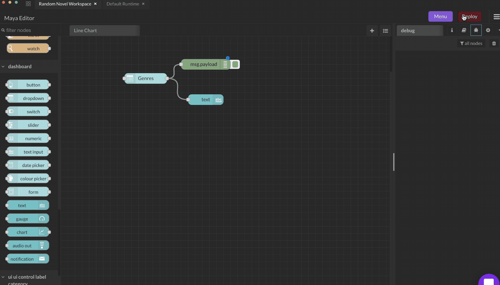

# Dropdown

Multiple value / label pairs can be added as required. If the label is not specified the value will be used for both.

The configured value of the selected item will be returned as `msg.payload`.

Setting `msg.payload` to the value will set the pre-selected choice in the dropdown.

Optionally the **Topic** field can be used to set the `msg.topic` property.

The Options may be configured by inputting `msg.options` containing an array. If just text then the value will be the same as the label, otherwise you can specify both by using an object of `"label":"value"` pairs :

`[ "Choice 1", "Choice 2", {"Choice 3":"3"} ]`

If the "Allow multiple selections" output option is enabled - the result will be returned as an array instead of a string.
