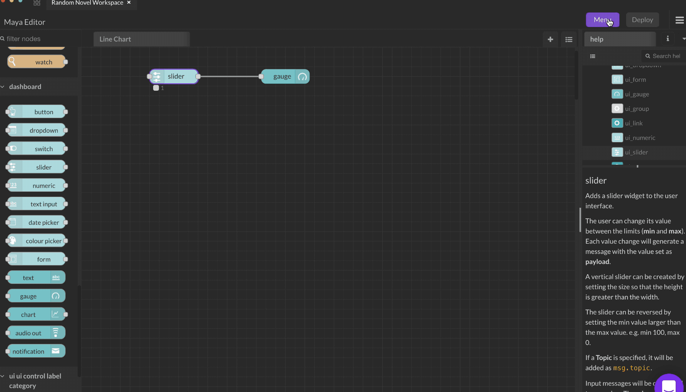

# Gauge

The `msg.payload` is searched for a numeric _value_ and is formatted in accordance with the defined **Value Format**, which can then be formatted using [Angular filters](https://scotch.io/tutorials/all-about-the-built-in-angularjs-filters).

For example : `{{value | number:1}}%` will round the value to one decimal place and append a % sign.

The colours of each of 3 sectors can be specified and the gauge will blend between them. The colours should be specified in hex (#rrggbb) format.

If you specify numbers for the sectors then the colours changes per sector. If not specified the colours are blended across the total range.

The gauge has several modes. Regular gauge, donut, compass and wave.

The label can also be set by a message property by setting the field to the name of the property, for example `{{msg.topic}}`.
