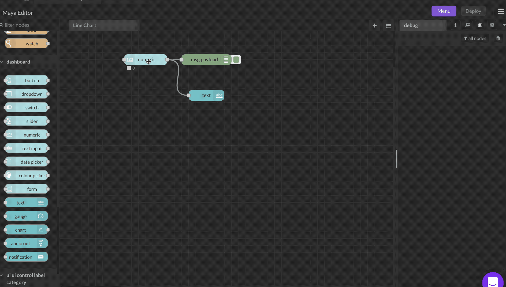

# Numeric Input

The user can set the value between the limits (**min** and **max**). Each value change will generate a `msg.payload`.

If **Topic** is specified, it will be added as `msg.topic`.

Any input messages will be converted to a number, the **min** value will be used if conversion fails, and it will update the user interface. If the value changes, it will also be passed to the output.

The **Value Format** field can be used to change the displayed format. For example, a **Value Format** of `{{value}} %` with a value of **23** will show **23 %** on the user interface. The **Value Format** field can contain HTML or Angular filters to format the output (eg: `&deg;` will show the degree symbol).

Setting the Value Format field to `{{msg.payload}}` will make the input field editable so you can type in a number.

The label can also be set by a message property by setting the field to the name of the property, for example `{{msg.topic}}`.

Setting `msg.enabled` to `false` will disable the widget output.

