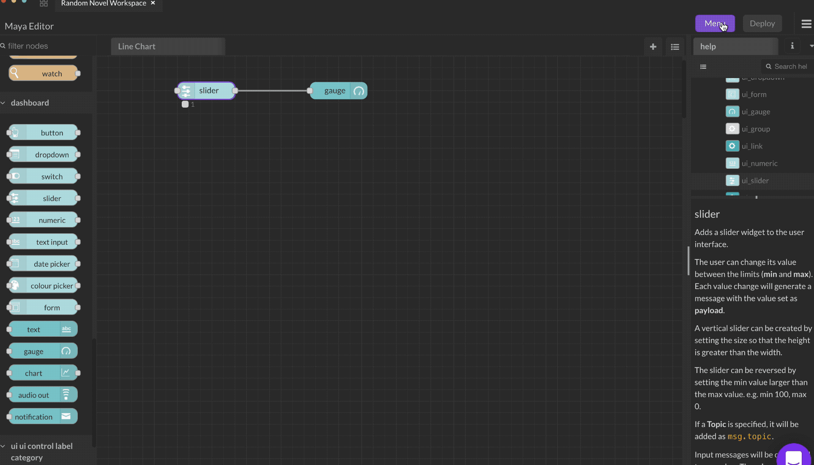

# Slider

The user can change its value between the limits (**min** and **max**). Each value change will generate a message with the value set as **payload**.

A vertical slider can be created by setting the size so that the height is greater than the width.

The slider can be reversed by setting the min value larger than the max value. e.g. min 100, max 0.

If a **Topic** is specified, it will be added as `msg.topic`.

Input messages will be converted to a number. The **min** value will be used if conversion fails, and it will update the user interface. If the value changes, it will also be passed to the output.

The label can also be set by a message property by setting the field to the name of the property, for example `{{msg.topic}}`.

Setting `msg.enabled` to `false` will disable the slider output.

Note: An input msg to the slider node will not change the status information displayed unless the slider node output is connected to another node.
