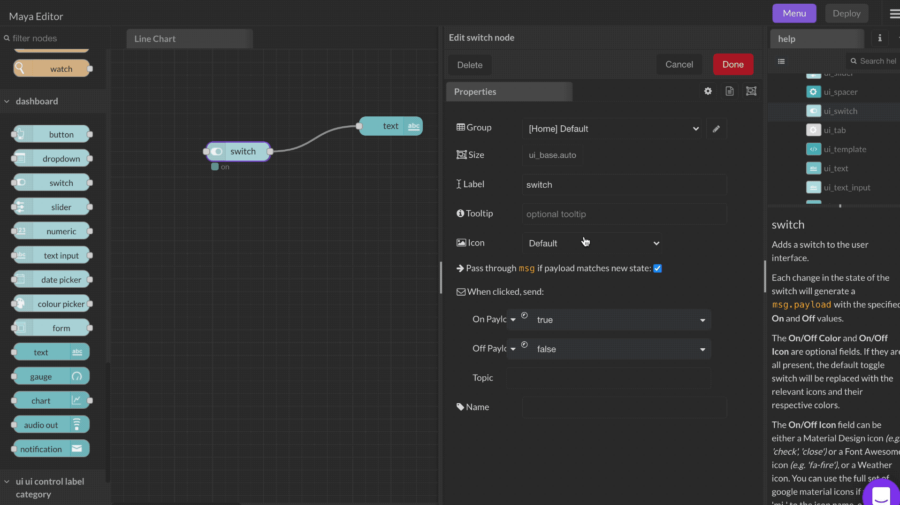

# Switch

### Inputs

* enabled (boolean) : Setting `msg.enabled` to `false` will disable the switch widget.

### Outputs

* `payload` (boolean | object | string) : Be default, a `true` or a `false` is emitted based on status of the switch, but what to emit can be changed.
* `topic` (string) : No topic is set by default, but it can be set in the `Topic` attribute.

Each change in the state of the switch will generate a `msg.payload` with the specified **On** and **Off** values.

The **On/Off Color** and **On/Off Icon** are optional fields. If they are all present, the default toggle switch will be replaced with the relevant icons and their respective colors.

The **On/Off Icon** field can be either a [Material Design icon](https://klarsys.github.io/angular-material-icons/) _(e.g. 'check', 'close')_ or a [Font Awesome icon](https://fontawesome.com/v4.7.0/icons/) _(e.g. 'fa-fire')_, or a [Weather icon](https://github.com/Paul-Reed/weather-icons-lite/blob/master/css\_mappings.md). You can use the full set of google material icons if you add 'mi-' to the icon name. e.g. 'mi-videogame\_asset'.

In pass through mode the switch state can be updated by an incoming `msg.payload` with the specified values, that must also match the specified type (number, string, etc). When not in passthrough mode then the icon can either track the state of the output - or the input msg.payload, in order to provide a closed loop feedback.

The label can also be set by a message property by setting the field to the name of the property, for example `{{msg.topic}}`.

If a **Topic** is specified, it will be added to the output as `msg.topic`.

\
